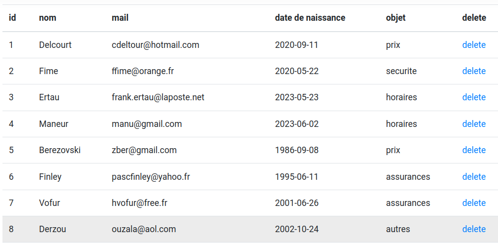
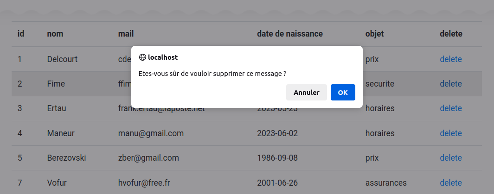
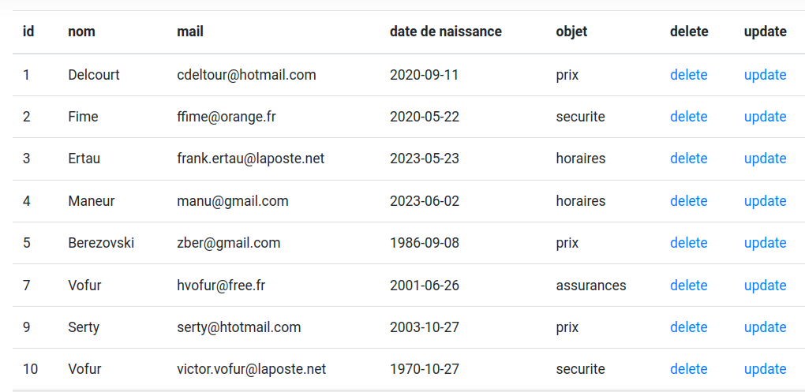

= PHP : Activité 1  PHP-MYSQL

:sectnums:
:toc: left
:toclevels: 4
:toc-title: Sommaire
:description: Exemple en Python
:keywords: AsciiDoc Python
:imagesdir: .
:sourcedir: ./src/
:source-highlighter: rouge 

 

ifdef::backend-html5[]  
++++
<link rel="stylesheet" href="https://cdnjs.cloudflare.com/ajax/libs/font-awesome/4.7.0/css/font-awesome.min.css">
++++
:html:
endif::[]

ifndef::html[]
:source-highlighter: pygments
:pygments-style: xcode
endif::[] 

:icons: font

== Prérequis

Vous devez avoir une plateforme de développement opérationnelle :

* serveur Apache, Mysql ou MariaDB, phpmyadmin 
* un répertoire personnel de publication de vos scripts PHP : *public_html* avec le mode PHP activé ainsi que l'affichage des erreurs.

Cette plateforme a été installée et testée lors de l'activité précédente. Si elle n'est pas présente sur votre poste de travail, vous allez devoir recommencer l'installation ( voir : annexe 1 )

== Traitement des données du formulaire

Lors de l'activité précédente vous avez modifié le formulaire de contact et récupéré les données du formulaire pour les afficher sur une page *contact.php*. En cours de cette activité nous allons stocker ces données dans une base et ensuite gérer les données de la base.

* Supprimer à l'aide de phpMyAdmin la base acf2l :  **DROP DATABASE acf2l** et exécuter le nouveau script sql ( Annexe 2 ) 
* Pour la suite pour avoir une base de travail homogène, vous allez télécharger le fichier *ACF2L.zip* sur l'ENT et le décompresser dans votre répertoire *public_html*.

* Dans le fichier *contact.php* , vous récupérez les données envoyées par le formulaire, ces données vont être insérées dans la *table message* de la base de données *acf2l*

=== Connexion à la base
Pour insérer les données vous devez vous connecter à la base 

Pour se connecter à une base avec PHP, il faut spécifier :

    *  un nom ou l'IP du serveur MYSQL
    * un nom d’utilisateur
    * un mot de passe
    * un nom de base.
      
La fonction de connexion :

* *mysqli_connect($server,$user,$password,$bdname)* 
 permet de se connecter au serveur *$server* en tant qu’utilisateur *$user* avec le mot de passe *$password* sur une base de données *$bdname*. 
* Cette fonction retourne TRUE en cas de succès, sinon FALSE
* mysqli_close() : permet de fermer la connexion

[,php]
----
<?php
 $server = "localhost";
 $user = "root"; <1>
 $password = "sio";
 $dbname = "acf2l";

 // Create connection
 $conn = new mysqli($server, $user, $password, $dbname);
 // Check connection
  if ($conn->connect_error){
    die("Connection failed: " . $conn->connect_error);
  }
  echo 'Connexion réussie';
?>
----
<1> à remplacer par vos identifiants de connexion

=== Requête SQL
Pour effectuer une requête SQL, on utilise la fonction : +
**mysql_query($conn,$requete)**.

Cette fonction prend pour paramètre deux éléments l'identifiant de la connection et la requête écrite en SQL, elle retourne un identificateur de résultat ou FALSE si échec.

[,php]
----
if ( !( $result = mysqli_query( $conn,$requete )))
	 die( "Erreur de la requete : $requete" );
----
On indique que si *$result* retourne FALSE, on arrête le traitement (*die*) et on affiche la requête pour pouvoir la corriger.

=== Insérer les données du formulaire 
L’insertion de données dans une table s’effectue à l’aide de la commande **INSERT INTO**. +
[,sql]
----
INSERT INTO table (nom_colonne_1, nom_colonne_2, ...
 VALUES ('valeur 1', 'valeur 2', ...)
----

Sur la page *contact.php*, vous avez toutes les données pour rédiger votre requête SQL :
[,php]
----
$nom = $_GET['nom'];
$email = $_GET['email'];
$date = $_GET['dateNaissance'];
$demande = $_GET['demande'];

$requete = "INSERT INTO message(nomPersonne,melPersonne,dateNaissance,objet) VALUES ('$nom','$email','$date','$demande');"
----

=== Synthèse

[,php]
----
<?php

	$server = "localhost"; <1>
 	$user = "root";
 	$password = "sio";
 	$dbname = "acf2l";

 	// Create connection
 	$conn = new mysqli($server, $user, $password, $dbname);
 	// Check connection
  	if ($conn->connect_error){
    	die("Connection failed: " . $conn->connect_error);
 	} 

	$nom = $_GET['nom']; <2>
	$email = $_GET['email'];
	$date = $_GET['dateNaissance'];
	$demande = $_GET['demande'];

	$requete = "INSERT INTO  message(nomPersonne,melPersonne,dateNaissance,objet) VALUES ('$nom','$email','$date','$demande');"; <3>

	if ( !( $result = mysqli_query( $conn,$requete )))
		die( "Erreur de la requete :". $conn -> error );  <4>
	
	mysqli_close($conn); <5>

	echo"<h2>Merci, Mr, Mme $nom pour votre prise de contact, nous vous repondrons prochainement </h2>"; <
?>

----

<1> connexion
<2> récupération des données
<3> rédaction de la requête SQL
<4> exécution de la requête
<5> on ferme la connexion

== Un peu de sécurité

=== Différence entre GET et POST
Pour des raisons pédagogiques, nous avons utilisé la méthode [red]#GET# pour l'envoi des données du formulaire. Lorsque la méthode GET est utilisée, toutes les données du formulaire sont codées dans l’URL et ajoutées à l’URL en tant que paramètres, la requête GET n’est pas sécurisée car les données sont exposées dans la barre d’URL et donc stockées dans l'historique de navigateur. +
Il est préférable d'envoyer les données avec la méthode [red]#POST#, les données du formulaire apparaissent dans le corps du message de la requête HTTP et ne sont plus visibles dans l'URL. +
Pour utilliser la métode POST, il suffit d'indiquer dans la balise < form action="contact.php" [red]#method="POST"#> +
et ensuite sur la page contact.php d'utiliser [red]#$nom = $_POST['nom']#

=== Ne jamais faire confiance aux données utilisateurs
Lorsqu’on crée des formulaires, c’est généralement pour demander aux utilisateurs de nous envoyer des données. Si on ne met pas en place des systèmes de filtre sur le type de données qui peuvent être envoyées pour chaque champ et de vérification ensuite de la qualité des données envoyées, les données récoltées vont alors pouvoir être aberrantes ou même potentiellement dangereuses. +
Une [red]#attaque XSS# consiste en l’injection d’un code dans le formulaire qui va permettre au hacker d’exécuter des scripts JavaScript, une redirection vers un autre site par exemple *window.location.href='http://www.w3docs.com/'*. On peut également envoyer des ordres SQL ( *DROPE TABLE users* ) , on parle dans ce cas [red]#d'injecton SQL#.

Le PHP nous offre différentes options pour sécuriser nos formulaires en testant la validité des données reçues : on va pouvoir utiliser des fonctions, des filtres, des expressions régulières, etc.

Ici, la première fonction que vous devez absolument connaitre est la fonction [red]#htmlspecialchars()#. Cette fonction va permettre d’échapper certains caractères spéciaux comme les chevrons « < » et « > » en les transformant en entités HTML.

En échappant les chevrons, on se prémunit d’une injection de code JavaScript puisque les balises <script> et /<script> vont être transformées en & <script> et &/<script> et ne vont donc pas être exécutées par le navigateur.

On va ensuite pouvoir utiliser d’autres fonctions pour nettoyer les données avant de les stocker comme [red]#trim()# qui va supprimer les espaces inutiles et [red]#stripslashes()# qui va supprimer les antislashes que certains hackers pourraient utiliser pour échapper des caractères spéciaux.

On peut ici créer une fonction personnalisée qui va se charger d’exécuter chacune des trois fonctions ci-dessus :

[,php]
----
function validDonnees($donnees){
        $donnees = trim($donnees);
        $donnees = stripslashes($donnees);
        $donnees = htmlspecialchars($donnees);
        return $donnees;
    }
----

=== isset() -  !empty()
Avant de récupérer les données d'un formulaire, il faut vérifier qu'elles ont bien été envoyées et qu'elles contiennent des valeurs . +
* La fonction [red]#isset()# vérifie l'existence d'une variable, exemple:  [red]#if (isset($_GET['nom'])#, si cette variable n'existe pas inutile d'essayer de récupérer sa valeur
* La fonction [red]#!empty()# vérifie si une variable n'est pas vide

[,php]
----
if ( isset($_GET['nom']) and !empty($_GET['nom'])){
				$nom = validDonnes($_GET['nom']);
		 }
----

== Gestion des données de la base 
[red]#CRUD# (create, read, update, delete) (créer, lire, mettre à jour, supprimer) est un acronyme pour les opérations réalisées sur des données stockées. +
Nous avons vu comment stocker des données avec l'ordre *SQL : INSERT*, nous allons voir les autres opérations *CRUD*.

=== READ : lecture des données
Sur une nouvelle page [red]#listeMessages.php#, vous allez devoir vous connecter à la base, rédiger la requête SQL, exécuter la requête et ensuite extraire les données pour les afficher.

* la connexion à la base est identique à celle vue pour les insertions.
* la requête SQL est une requête de sélection. L’utilisation la plus courante de SQL consiste à lire des données issues de la base de données. Cela s’effectue grâce à la commande [red]#SELECT#, qui retourne des enregistrements dans un tableau de résultat. L’utilisation basique de cette commande s’effectue de la manière suivante:
[,sql]
----
SELECT nom_du_champ FROM nom_table ;
----
Cette requête SQL va sélectionner *(SELECT)* le champ “nom_du_champ” provenant *(FROM)* de la table appelée “nom_table”. Si vous souhaitez afficher tous les champs, il suffit de remplacer le nom du/des champs par une [red]#*#. Exemple, on souhaite afficher toutes les données de la table message :

[,sql]
----
SELECT * FROM message ;
----
* Exécution de la requête SQL

[,php]
----
$requete = "SELECT * FROM message";

if ( !( $result = mysqli_query( $conn,$requete )))
	 die( 'Erreur de la requete : '.$requete );
----
Comme pour les insertions, on indique que si [red]#$result# retourne FALSE, on arrête le traitement (die) et on affiche la requête. +
L’identificateur de résultat [red]#$result# permettra à d’autres fonctions d’extraire ligne par ligne les données retournées par le serveur.

. Extraction des données +
L’affichage des résultats d’une requête se fait ligne par ligne. Une boucle permettra de recueillir chacune des lignes à partir de l’identifiant de résultat ($result) dans un tableau associatif : [red]#mysqli_fetch_assoc($result)# . Les clés étant les noms des champs de la table . Elle retourne FALSE s’il n’y a plus aucune ligne.

[,php]
----
<table class="table table-hover">
	<thead>
		<th>id</th>
		<th>nom</th>
		<th>mail</th>
		<th>date de naissance</th>
		<th>objet</th>
    </thead>
		
<?php
	//On teste si la requete retourne des résultats
	if (mysqli_num_rows($result) > 0) {
	// On exploite chaque ligne de résultat
    	while( $row = mysqli_fetch_assoc($result) ) {
          //print_r($row);
          echo "<tr>";
            echo "<td>".$row['idMessage']."</td>";
            echo "<td>".$row['nomPersonne']."</td>";
            echo "<td>".$row['melPersonne']."</td>";
            echo "<td>".$row['dateNaissance']."</td>";
            echo "<td>".$row['objet']."</td>";
          echo "</tr>";
       }
    }

?>
</table>
----

==== Synthèse
Sélection de tous les messages et affichage dans un tableau

[,php]
----
<?php

	$server = "localhost";
 	$user = "root";
 	$password = "sio";
 	$dbname = "acf2l";

 	// Create connection
 	$conn = new mysqli($server, $user, $password, $dbname);
 	// Check connection
  	if ($conn->connect_error){
    	die("Connection failed: " . $conn->connect_error); <1>
 	}

 	$requete = "SELECT * FROM message";

  if ( !( $result = mysqli_query( $conn,$requete )))
	   die( 'Erreur de la requete : '.$requete ); <2>

	 
?>
<table class="table table-hover"> <3>
	<thead>
		<th>id</th>
		<th>nom</th>
		<th>mail</th>
		<th>date de naissance</th>
		<th>objet</th>
	</thead>
		
<?php
	//On teste si la requete retourne des résultats
	if (mysqli_num_rows($result) > 0) {
	// On exploite chaque ligne de résultat
    	while( $row = mysqli_fetch_assoc($result) ) { <4>
          //print_r($row);
          echo "<tr>";
            echo "<td>".$row['idMessage']."</td>";
            echo "<td>".$row['nomPersonne']."</td>";
            echo "<td>".$row['melPersonne']."</td>";
            echo "<td>".$row['dateNaissance']."</td>";
            echo "<td>".$row['objet']."</td>";
          echo "</tr>";
       }
    }

?>
</table>

----

<1> connexion à la base
<2> Exécution de la requête
<3> corps du tableau en html
<4> extraction de chaque ligne de résultat dans un tableau associatif avec comme clé l'intutilé de chaque champ de la table

=== DELETE en SQL permet de supprimer des lignes dans une table.

La syntaxe SQL pour supprimer des lignes est la suivante :

[,sql]
----
DELETE FROM `table` WHERE condition
----

IMPORTANT: s’il n’y a pas de condition WHERE alors toutes les lignes seront supprimées et la table sera alors vide.

Une table doit contenir un champ qui identifie de manière unique chaque ligne ou entité, c'est le rôle de [red]#l'identifiant# ou ID qui en général est auto-incrémnté, c'est à dire que c'est le système de base de données qui se chargera de lui donner une valeur. Ainsi si on veut supprimer un message on utilisera l'identifiant du message 

[,sql]
----
DELETE FROM `message` WHERE idMessage = 1
----

On va donc ajouter une colonne à la liste des messages avec un lien vers une page deleteMessage.php et avec l'identifiant du message en paramètre.

* On aloute une entête *delete*
[,html]
----
<th>delete</th>
----
* contenu de la cellule, un lien qui pointe vers la page *deleteMessage.php* avec un paramère *id* dont le contenu est l'identifiant du message *$row['idMessage']*

[,php]
----
echo "<td><a href=deleteMessage.php?id=".$row['idMessage'].">delete</a></td>";
----

Si vous passer la souris sur les différents liens, vous devez voir le paramètre *id* changer de valeur pour prendre *l'identifiant* des différents messages. Si vous cliquez sur le lien, le navigateur vous indiquera que la page *deleteMessage.php* n'existe pas, vous devez la créer.

* Sur la page deleteMessage.php, on se connecte à la base, on récupère l'identifiant dans l'URL pour rédiger et exécuter la requête SQL de suppression, ensuite on redirige l'utilisateur vers la liste des messages.

* deleteMessage.php

[,php]
----
<?php

	$server = "localhost";
 	$user = "root";
 	$password = "sio";
 	$dbname = "acf2l";

 	// Create connection
 	$conn = new mysqli($server, $user, $password, $dbname);
 	// Check connection
  	if ($conn->connect_error){
    	die("Connection failed: " . $conn->connect_error);
 	}

	$id = $_GET['id'];

	$requete = "DELETE FROM  message where idMessage = $id";

	if ( !( $result = mysqli_query( $conn,$requete )))
		die( "Erreur de la requete :". $conn -> error );

	mysqli_close($conn);

	header('Location: listeMessages.php'); <1>
?>
----

<1> la page *deleteMessage.php* ne va rien afficher, elle s'occupe simplement d'exécuter la requête de suppression ensuite avec la fonction [red]#header#, on redirige l'utilisateur vers la page listeMessages.php

* avant de supprimer un message, vous pouvez faire apparaître une boîte de dialogue Javascript. La fonction *confirm* affiche une fenêtre avec une question et deux boutons : OK et Annuler. Le résultat est *true* si vous appuyez sur OK et *false* dans le cas contraire.

*onClick=\"return(confirm('Etes-vous sûr de vouloir supprimer ce message ?'));\"*

[,php]
----
echo "<td><a href=deleteMessage.php?id=".$row['idMessage']." onClick=\"return(confirm('Etes-vous sûr de vouloir supprimer ce message ?'));\">delete</a></td> ";
----

== UPDATE : pour mettre à jour les données

La syntaxe SQL pour metre à jour des données est la suivante :

[,sql]
----
UPDATE table
SET colonne_1 = 'valeur 1', colonne_2 = 'valeur 2', colonne_3 = 'valeur 3'
WHERE condition
----

IMPORTANT: s’il n’y a pas de condition WHERE alors toutes les lignes seront mises à jour

On va donc ajouter une colonne à la liste des messages avec un lien vers une page updateMessage.php et avec l'identifiant du message en paramètre.

* On aloute une entête *update*
[,html]
----
<th>update</th>
----
* contenu de la cellule, un lien qui pointe vers la page *updateMessage.php* avec un paramère *id* dont le contenu est l'identifiant du message *$row['idMessage']*

[,php]
----
echo "<td><a href=updateForm.php?id=".$row['idMessage'].">update</a></td>";
----

L'opération d'update est plus déicate, il faut présenter le formulaire avec les données du message à corriger, il faut donc faire une requête de sélection de toutes les données du message à partir de son identifiant.

* le formulaire de mise à jour : updateForm.php

[,php]
----
<?php

	if ( isset($_GET['id']) and !empty($_GET['id'])){
	    $id = $_GET['id'];
	} <1>
	else {
		 header('Location: listeMessages.php');
	}

	$server = "localhost";
 	$user = "root";
 	$password = "sio";
 	$dbname = "acf2l";

 	// Create connection
 	$conn = new mysqli($server, $user, $password, $dbname);
 	// Check connection
  	if ($conn->connect_error){
    	die("Connection failed: " . $conn->connect_error);
 	}

	$requete = "SELECT * FROM  message where idMessage = $id";

	if ( !( $result = mysqli_query( $conn,$requete )))
		die( "Erreur de la requete :". $conn -> error );

	$row = mysqli_fetch_assoc($result); <2>
	//print_r($row);
	
    mysqli_close($conn);
?>

<!-- Contact Form start -->
	

		<form id="contactForm" action="updateMessage.php" method="get">
			<input name="id" type="hidden" value="<?php echo $row['idMessage']; ?>" /> <3>
			

				

					<input type="text" class="form-control" value="<?php echo $row['nomPersonne']; ?>" name="nom" required />
				

								
				

					<input type="email" class="form-control" value="<?php echo $row['melPersonne']; ?>" name="email"/>
				

								
				

					<label>Date de naissance : </label>
					<input type="date" class="form-control" value="<?php echo $row['dateNaissance']; ?>" name="dateNaissance">
				

								
				

					Votre demande :
					<select  class="form-control" name="demande" required >
					    <option value="" disabled selected>Selectionner une option</option>
  						<option value="prix">prix</option>
  						<option value="sécurité">sécurité</option>
  						<option value="assurances">assurances</option>
  						<option value="horaires">horaires</option>
  						<option value="autres">Autres</option>
					</select>
				

								
				

				    <button type="submit" class="btn-contact">Submit</button>
				

			

		</form>
	

<!-- Contact Form end -->
----

<1> on vérifie que le paramère id est dans l'URL et qu'il n'est pas vide, dans le cas contraire on redirige vers la page : listeMessages.php

<2> la requête ne retourne qu'une seule ligne, [red]#mysqli_fetch_assoc($result)# retourne cette ligne dans le tableau associatif suivant pour le premier message ( vous pouvez décommenter la ligne *//print_r($row)*  :
	Array ( [idMessage] => 1 [nomPersonne] => Delcourt [melPersonne] => cdeltour@hotmail.com [dateNaissance] => 2020-09-11 [objet] => prix ), il suffit de mettre ces données dans l'attribut value du formulaire [red]#value="<?php echo $row['nomPersonne']; ?>"#

<3> Les éléments [red]#<input  type="hidden"# permettent  d'inclure des données qui ne peuvent pas être vues ou modifiées lorsque le formulaire est envoyé. Cela permet par exemple d'envoyer l'identifiant du message nécessaire pour le sélectionner e]t le mettre à jour. Les champs de ce type sont invisibles sur la page.

* les données du formulaire de mise à jour sont envoyées à la page *updateMessage.php*, comme pour la page *deleteMessage.php*, cette page n'affichera rien, elle va récupérer les données du formulaire et mettre à jour les données puis redigera l'utilisateur sur la page *listeMessages.php*.

[red]#updateMesage.php#

[,php]
----
<?php

	$server = "localhost";
 	$user = "root";
 	$password = "sio";
 	$dbname = "acf2l";

 	// Create connection
 	$conn = new mysqli($server, $user, $password, $dbname);
 	// Check connection
  	if ($conn->connect_error){
    	die("Connection failed: " . $conn->connect_error);
 	}

	$id = $_GET['id'];
	$nom = $_GET['nom'];
	$email = $_GET['email'];
	$date = $_GET['dateNaissance'];
	$demande = $_GET['demande'];

	$requete = "UPDATE message set nomPersonne='$nom', melPersonne='$email', dateNaissance='$date', objet='$demande' where idMessage = $id";

	if ( !( $result = mysqli_query( $conn,$requete )))
		die( "Erreur de la requete :". $conn -> error );

	mysqli_close($conn);

	header('Location: listeMessages.php');
?>
----

== LES HEADER ET FOOTER

Une page est généralement composée d'un header et d'un footer.

Le *header* peut comprendre (liste non exhaustive) : un menu, un logo, des liens vers des réseaux sociaux, ...

Le *footer* reprend en général les mentions légales, et aussi vers les liens vers certaines pages qui ne sont pas listées dans le menu.

En général toutes les pages de votre site ont le même header et footer, aussi pour éviter de les recopier sur chaque page et de devoir internir sur chaque page en cas de modification, nous allons créer un fichier *header.html* et un fichier *footer.html* et les inclure dans vos différentes pages grâce à la fonction PHP : [red]#require_once#.

Le principe est assez simple, il suffit de créer un fichier *header.html* ou *header.php* dans lequel vous allez recopier toute la partie header de votre page principale  et ensuite vous pouvez remplacer le code recopié par : [red]#<?php require_once('header.html'); ?>#. (On effectue la même opération pour le footer)

WARNING: vous devez modifier l'extention de vos fichiers html pour que le PHP soit interprété, par exemple votre ficher *index.html* sera renommé en *index.php*

IMPORTANT: Lorsque votre site prend de l'importance, le code devient vite illisible et incompréhensible si vous ne pensez pas à l'organiser . Mais comment organiser son code de manière à être le plus clair possible ? Il existe de nombreuses solutions, chacune ayant ses avantages et ses inconvénients.
L'une des solutions fréquemment retenue est de dissocier la vue c'est à dire le code xHTML visible, du traitement des données c'est à dire de l'accès aux bases de données et le contrôle des résultats. On parle alors de modèles [red]#MVC# : Modèle Vue Contrôleur. Ce qui fera l'objet de la 2e activité.

== Annexe 1 : Plateforme de dévellopement 

* LAMP est un acronyme pour Linux, Apache, MySQL, PHP. C'est une pile logicielle comprenant le système d'exploitation, un serveur HTTP, un système de gestion de bases de données et un langage de programmation interprété, et qui permet de mettre en place un serveur web. https://doc.ubuntu-fr.org/lamp[Ubuntu - Serveur LAMP]
* phpMyAdmin est une interface web en PHP pour administrer à distance les SGBD MySQL et MariaDB. https://doc.ubuntu-fr.org/phpmyadmin[Ubuntu PhpMyAdmin]
* Le serveur Web Apache, permet de publier des pages PHP depuis le dossier personnel des utilisateurs du système. Pour cela il est nécessaire d'activer le mode UserDir sur le serveur Apache.
Pour activer le mode UserDir il faut :
    1. activer le module en tapant la commande +
    *sudo a2enmod userdir*
    2. redémarrer le serveur Apache en tapant la commande +
    *sudo systemctl restart apache2*
    3. créer un dossier *public_html* dans le répertoire personnel de chaque utilisateur qui veut partager leurs fichiers
exemple : *mkdir ~rvolfoni/public_html*
(crée un dossier public_html dans le répertoire personnel de l'utilisateur rvolfoni)
    4. modifier les droits des dossiers personnels des utilisateur qui vont partager leurs fichiers car ce dossier est inaccessible par défaut pour Apache
exemple : *chmod o+rx /home/rvolfoni*
( autorise les utilisateur autres que le propriétaire du dossier -- rvolfoni -- à accéder au dossier en lecture seule )
    5. Par défaut en mode userdir le PHP n’est pas activé, vous devez modifier le fichier : +
	*sudo vim /etc/apache2/mods-enabled/php8.1.conf* +
et passer la directive php sur On +
	*php_admin_flag engine On*
	6. Par défaut, le serveur Apache n'affiche pas les erreurs alors que c'est nécessaire lorsque l'on développe une application. Pour activer l'affichage des erreurs sur Ubuntu
        - sudo vim /etc/php/8.1/apache2/php.ini. Repérez ceci :
        -  *display_errors = Off*. Et passez-le à cela :
        - *display_errors = On*. Enfin, redémarrez Apache :
        - *sudo systemctl restart apache2*

== Annexe 2 : Script SQL - base acf2l

====
[,sql]
----
--
-- Base de données :  `acf2l`
--
CREATE DATABASE IF NOT EXISTS `acf2l` DEFAULT CHARACTER SET utf8 COLLATE utf8_general_ci;
USE `acf2l`;

-- --------------------------------------------------------

--
-- Structure de la table `message`
--

CREATE TABLE `message` (
  `idMessage` int(4) NOT NULL AUTO_INCREMENT,
  `nomPersonne` varchar(20) NOT NULL,
  `melPersonne` varchar(70) NOT NULL,
  `dateNaissance` date NOT NULL,
  `objet` varchar(20) NOT NULL,
   PRIMARY KEY (`idMessage`)
) ENGINE=InnoDB DEFAULT CHARSET=utf8;

--
-- Déchargement des données de la table `message`
--

INSERT INTO `message` (nomPersonne,melPersonne,dateNaissance,objet) VALUES
('Delcourt', 'cdeltour@hotmail.com', '2020-09-11', 'prix'),
('Fime', 'ffime@orange.fr', '2020-05-22', 'securite'),
('Ertau', 'frank.ertau@laposte.net', '2023-05-23', 'horaires'),
('Maneur', 'manu@gmail.com', '2023-06-02', 'horaires'),
('Berezovski', 'zber@gmail.com', '1986-09-08', 'prix'),
('Finley', 'pascfinley@yahoo.fr', '1995-06-11', 'assurances'),
('Vofur', 'hvofur@free.fr', '2001-06-26', 'assurances'),
('Derzou', 'ouzala@aol.com', '2002-10-24', 'autres'),
('Serty', 'serty@htotmail.com', '2003-10-27', 'prix'),
('Vofur', 'victor.vofur@laposte.net', '1970-10-27', 'securite'),
('Calende', 'calende@orange.fr', '1975-06-21', 'autres'),
('Jemba', 'jaimeba@yahoo.fr', '1999-10-30', 'horaires'),
('Morin', 'morinsev@hotmail.com', '1987-10-22', 'horaires'),
('Benrech', 'recb@gmail.com', '1988-06-26', 'securite'),
('Nguyen', 'nguyen774@wanadoo.fr', '1967-11-06', 'prix'),
('Louali', 'kloua@caramail.fr', '2000-11-28', 'prix'),
('Paolo', 'jp.paolo@caramail.fr', '1976-06-02', 'prix'),
('Map', 'leplusbeaudu77@gmail.com', '2001-06-02', 'autres'),
('Kounde', 'koundell@orange.fr', '2003-11-16', 'prix'),
('Derissam', 'jjdd@gmail.com', '2000-12-01', 'securite');
--
-- Index pour les tables déchargées
--

--
----
